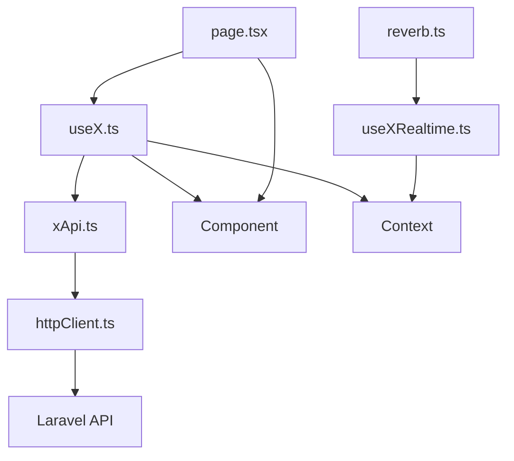
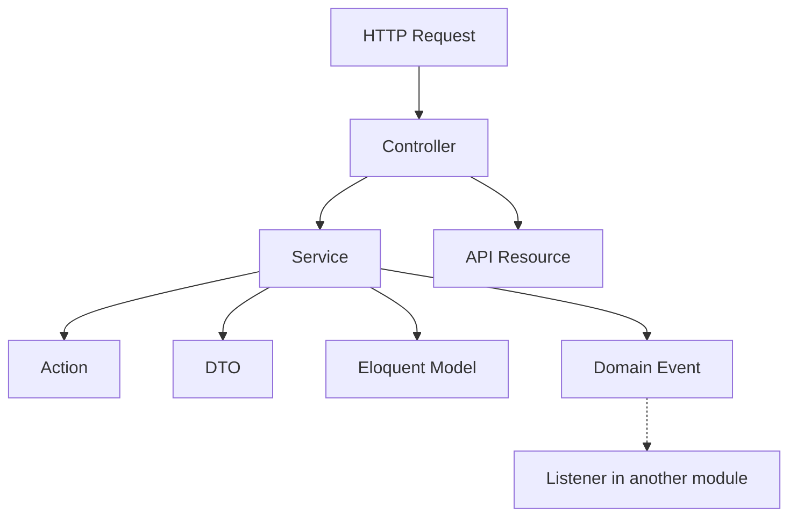

# Architecture Constitution — Larablog  
**Single Source of Truth (SSOT) — Generative Modular Architecture**

> **Philosophy**  
> Pragmatic Modular Monolith + Lightweight DDD.  
> Eloquent Models are Domain Entities. Business logic lives in Services/Actions.  
> Frontend: pages orchestrate, hooks own logic, components present.  
>  
> **Open-World Principle:** This system scales to **thousands of Bounded Contexts**.  
> Current modules are only **Initial Seed Modules**. Every AI/developer must assume an **infinite module space** and create new contexts whenever a new business capability emerges.  
>  
> No unnecessary repositories. No pure Domain entities with mappers. No over-engineering.

This document is the **only authoritative source** for every developer and AI.  
Any code that violates these rules is incorrect and must be refactored.

---

## 1. Bounded Contexts (Modules) & Infinite Scalability

```mermaid
flowchart LR
    SK[Shared Kernel<br/>User, truly shared VOs/Traits]:::kernel
    C1[{Context A}<br/>Domain capability]:::ctx
    C2[{Context B}<br/>Domain capability]:::ctx
    C3[{Context C}<br/>Domain capability]:::ctx
    C4[{Context D}<br/>Domain capability]:::ctx
    C5[{Context E}<br/>Domain capability]:::ctx
    AGG[Aggregator Context<br/>Cross-module aggregation]:::ctx
    NEW[??? New Contexts ???<br/>Billing, Notifications, Analytics...]:::new

    C1 -.->|contract| SK
    C2 -.->|contract| SK
    C3 -.->|contract| SK
    AGG -.->|contract| C1
    AGG -.->|contract| C2
    NEW -.->|contract| SK
    C3 -.->|event| C4
    C2 -.->|event| C5
    C2 -.->|event| C4

    classDef kernel fill:#fef3c7,stroke:#d97706,stroke-width:2px
    classDef ctx fill:#eff6ff,stroke:#3b82f6,stroke-width:1px
    classDef new fill:#f3e8ff,stroke:#9333ea,stroke-width:2px,stroke-dasharray: 5 5
```

- **The Infinity Rule:** Every new feature belongs to exactly one module. If it does not semantically fit into an existing module with **100% alignment**, create a new Bounded Context.  
- **Avoid God Modules:** Never force a new capability into an existing module just to avoid a new folder. Over-segmentation is cheaper than Semantic Coupling.  
- Modules never import another module’s Models, Controllers, or internal classes.  
- Cross-module communication is allowed only through the two legal channels defined in **Article IV**.  
- **Aggregator contexts** are lightweight modules for admin or public endpoints needing data from multiple modules. They contain no business logic.

---

## 2. Backend Directory Structure

```text
larablog-api/
├── app/                              # Framework bootstrap only
├── bootstrap/
├── config/
│   └── modules.php                   # Registry of enabled modules
├── database/
│   ├── migrations/                   # FLAT – module-prefixed timestamps
│   ├── seeders/
│   └── factories/
├── routes/
│   ├── api.php                       # Only loads module route files
│   ├── channels.php
│   └── web.php
├── tests/
│   ├── Architecture/                 # Pest arch tests (boundaries)
│   ├── Feature/
│   └── Unit/
└── src/
    ├── Shared/                       # SHARED KERNEL (keep extremely lean)
    │   ├── Models/
    │   │   └── User.php
    │   ├── ValueObjects/
    │   │   ├── Slug.php
    │   │   ├── Email.php
    │   │   └── ReadingTime.php
    │   ├── Traits/
    │   │   └── HasUuid.php
    │   └── SharedServiceProvider.php
    └── Modules/
        ├── {Context}/                # ← placeholder for ANY new module
        ├── {ContextA}/               # Seed module (example)
        ├── {ContextB}/               # Seed module (example)
        ├── {ContextC}/               # Seed module (example)
        └── {AggregatorContext}/      # Aggregator module (example)
```

**Shared Kernel — Initial Inventory:**  
- Models: `User` (the only shared Eloquent model)  
- ValueObjects: `Slug`, `Email`, `ReadingTime`  
- Traits: `HasUuid`

**Promotion Rule:** Add to Shared Kernel **only** if a concept is required by **three or more Bounded Contexts** and does not belong to a single domain. This requires a deliberate review.

### 2.1 Module Skeleton (mandatory for every new/existing module)

```text
src/Modules/{Context}/
├── {Context}ServiceProvider.php
├── Models/
├── Services/
│   └── Contracts/                    # Public service interfaces for cross-module access
├── Actions/
├── DTOs/
├── Http/
│   ├── Controllers/Api/
│   ├── Requests/
│   └── Resources/
├── Policies/
├── Events/
├── Listeners/
├── Jobs/                             # if needed
├── Mail/                             # if needed
└── Routes/
    ├── api.php
    └── admin.php
```

For aggregator modules (e.g., a lightweight cross-module context), the skeleton may be simpler (no Models/Events/Policies), but **ServiceProvider, Routes, Http** are mandatory.

---

## 3. Frontend Directory Structures

### 3.1 Next.js Public Site (App Router)

```text
larablog-web/
├── app/                                      # THIN orchestrator only
│   ├── (auth)/
│   ├── (public)/
│   ├── (dashboard)/
│   ├── layout.tsx
│   └── globals.css
├── src/
│   ├── features/                             # Domain modules — mirrors backend
│   │   └── {domain}/                         # ← create new feature dirs as needed
│   ├── shared/
│   │   ├── api/
│   │   │   ├── httpClient.ts
│   │   │   └── endpoints.ts
│   │   ├── lib/
│   │   │   ├── reverb.ts
│   │   │   ├── seo.ts
│   │   │   └── format.ts
│   │   ├── hooks/
│   │   ├── types/
│   │   └── config/env.ts
│   └── providers/
│       ├── AppProviders.tsx
│       ├── QueryProvider.tsx
│       ├── AuthProvider.tsx
│       └── ThemeProvider.tsx
├── proxy.ts                             # Auth gate for /dashboard
└── next.config.ts
```

### 3.2 React Admin Panel (Vite)

```text
larablog-admin/
└── src/
    ├── app/
    │   ├── App.tsx
    │   ├── router.tsx
    │   └── providers.tsx
    ├── pages/# Thin orchestrators
    │   ├── Login.tsx
    │   ├── Dashboard.tsx
    │   └── {Page}.tsx
    ├── features/
    │   └── {domain}/
    └── shared/
        ├── api/httpClient.ts
        ├── components/
        ├── hooks/usePermissions.ts
        └── lib/format.ts
```

### 3.3 Mandatory Feature Anatomy

```text
src/features/{domain}/
├── api/
│   └── {domain}Api.ts
├── hooks/
│   ├── use{Something}.ts
│   └── use{Something}Realtime.ts
├── components/
├── context/
├── types/
└── index.ts                          # Public barrel — export only what other features may use
```

**Cross-feature imports:** Features may import only from another feature’s **public barrel** (`index.ts`). Never import another feature’s internal files (`hooks/`, `components/`, `api/` directly). Prefer composition at page level.

---

## 4. Frontend Data Flow (Mandatory)



- Page never imports `httpClient`, never calls `fetch`, never holds business state.  
- Component never imports data-fetching hooks or `httpClient`. Props in, events out.  
- All fetching/caching/mutations/optimistic updates/realtime live in hooks.

---

## 5. Layer Dependency Flow (Backend)



---

## 6. Constitution — Non-Negotiable Rules

### Article 0 — Open-World Scalability
Before coding a new requirement, ask: *“Does this introduce new Ubiquitous Language or a distinct lifecycle?”*  
If **YES**, create a new Bounded Context (backend module + frontend feature). Creating `src/Modules/{NewContext}` is a standard, lightweight operation.

### Article I — Thin Controllers
Controllers only:
1. Receive already-validated `FormRequest`
2. Call exactly one Service method (passing DTO/validated data)
3. Return API Resource or JSON

Forbidden: business logic, `DB::`, direct Eloquent queries, transactions.

### Article II — Pragmatic DDD
- Eloquent Models are Domain Entities.
- Services talk directly to Eloquent Models.
- Prefer Local Scopes over query duplication.
- No Repository interfaces by default.
- DTOs for write operations with ≥2 meaningful params.
- Extract Action when logic is reused or Service grows.

### Article III — Strict Module Boundaries
- Never import another module’s **Model, Controller, or internal class**.
- Allowed: importing from `Shared\`.
- Cross-module synchronous access is allowed **only through public Service Contracts** (see Article IV).
- Enforced by Pest Architecture tests.

### Article IV — Cross-Module Communication

| Type | When | How |
| :--- | :--- | :--- |
| **Synchronous (Read)** | Need data from another module in same request | Inject the module’s **public Service interface** from `Services/Contracts/`. If no interface exists, create one before crossing boundaries. |
| **Asynchronous (Write/Side-effect)** | React after something happened | Dispatch a Domain Event. Other modules listen. |

**Never** import another module’s concrete Service, Model, Controller, or any internal class. The interface is the only legal synchronous path.

### Article V — Frontend Layering (Strict)

| Layer | Responsibility | Forbidden |
| :--- | :--- | :--- |
| `app/` or `pages/` | Compose hooks + presentational components | fetch, business if, React Query, non-UI state |
| `features/*/hooks` | All business logic, API calls, React Query, realtime | Returning JSX |
| `features/*/components` | Pure presentation (props in, events out) | useQuery, useMutation, httpClient, business conditions |
| `features/*/context` | Shared state within same feature | Direct API calls |
| `shared/` | Generic utilities | Importing anything from `features/` |

### Article VI — React Query Rules
- Every server state goes through React Query.
- Query keys must be structured and exported from the feature:
  ```ts
  export const postKeys = {
    all: ['posts'] as const,
    lists: () => [...postKeys.all, 'list'] as const,
    list: (filters: PostFilters) => [...postKeys.lists(), filters] as const,
    details: () => [...postKeys.all, 'detail'] as const,
    detail: (slug: string) => [...postKeys.details(), slug] as const,
  };
  ```
- Mutations must invalidate correct query keys.
- Prefer optimistic updates for save/unsave, like/unlike, etc.
- Never call `httpClient` directly inside a component or page.

### Article VII — Authentication & Realtime
- Public Next.js: Sanctum cookie-based (`withCredentials: true`). Auth state in `AuthProvider` + `useAuth`.
- Admin: Sanctum token in localStorage + Axios interceptor.
- Realtime (Reverb): Config only in `shared/lib/reverb.ts`. Subscriptions only inside feature hooks. Always cleanup in `useEffect` return.
- Auth gate (`proxy.ts`) protects `/dashboard` routes.

### Article VIII — Error Handling & Loading States

**Frontend:**  
- Hooks return: `{ data, isLoading, isError, error, … }`
- Components receive `isLoading`/`isError` and render skeletons/error UI.
- Toast notifications triggered only from hooks.

**Backend:**  
- Services throw module-specific `DomainException` (or custom exception implementing shared interface) when business rule violated.  
- Controllers do **not** catch these exceptions.  
- Global ExceptionHandler converts them into JSON responses.  
- DomainException should define its HTTP status: **default mapping** — 422 business rule violation, 404 not found, 403 authorization.

### Article IX — SEO (Next.js only)
- Every public page exports `generateMetadata`.
- Use helpers from `shared/lib/seo.ts`.
- JSON-LD structured data for posts and authors is mandatory.

### Article X — Authentication & Authorization (Backend)
- Public: Sanctum cookie SPA. Admin: Sanctum token.
- Authorization: Spatie + Policies. Policies live inside each module.

### Article XI — Database
- Migrations flat in `database/migrations/`.
- Filename: `YYYY_MM_DD_HHMMSS_{module}_{description}.php`
- If module count grows large, `loadMigrationsFrom()` in module ServiceProvider is permitted.

### Article XII — Naming Conventions

| Element | Convention | Example |
| :--- | :--- | :--- |
| Module | `Modules\{Context}` | `Modules\{NewContext}` |
| Model | Singular | `Post` |
| Service | `{Aggregate}Service` | `PostService` |
| Action | `{Verb}{Aggregate}Action` | `PublishPostAction` |
| DTO | `{Aggregate}{Purpose}DTO` | `PostCreateDTO` |
| Event | Past tense | `PostPublished` |
| FormRequest | `{Verb}{Aggregate}Request` | `StorePostRequest` |
| Resource | `{Aggregate}Resource` | `PostResource` |
| Policy | `{Aggregate}Policy` | `PostPolicy` |
| Frontend Hook | `use{Something}` | `usePostList` |
| Frontend API file | `{domain}Api.ts` | `postsApi.ts` |

### Article XIII — File Size & Complexity
- Prefer ≤ 180–200 lines.
- Service grows → extract Actions.
- Component grows → split.
- Page contains logic → move to hook.

### Article XIV — Testing Strategy
1. **Architecture tests (Pest)** — boundaries, run first in CI.
2. **Feature tests** — HTTP → DB, `RefreshDatabase`.
3. **Service tests** — `RefreshDatabase`, integration with Eloquent.
4. **Unit tests** — pure functions, ValueObjects, Actions.
5. **Frontend tests** — React Testing Library for hooks/components + Playwright for key journeys.

---

## 7. Current Roadmap (Seed Modules Only)

*This roadmap covers only the initial Seed Modules. Future phases will generate entirely new Bounded Contexts.*

| Phase | Primary Module(s) | Notes |
| :--- | :--- | :--- |
| 1 | Context A | Auth, roles, OAuth |
| 2 | Context B | CRUD Posts, Categories, Tags |
| 3 | Context A + Context B | Public read APIs |
| 4 | Context C | Comments + Reverb |
| 5 | Context D | Saved posts, dashboard |
| 6 | Context E | Newsletter, contact |
| 7 | Context F | Rich editors, media |
| 8 | Context G, Aggregator Context | Settings, Team, Admin aggregation |

---

## 8. Developer & AI Playbook

### Domain Discovery Algorithm

1. **Evaluate Context:** Does this requirement introduce new Ubiquitous Language or a distinct lifecycle?  
   - **Yes → Create a new Bounded Context** (backend module + frontend feature).  
   - **No (100% semantic fit) → Extend existing module.**

2. **Decision Table:**

| Requirement | Create | Location | Communication |
| :--- | :--- | :--- | :--- |
| **New domain capability** | **NEW Module** | `src/Modules/{NewContext}` + `features/{new_domain}` | Events or Service calls |
| New entity in existing domain | Model + Migration + Service + Controller + Resource + Routes + Policy | Existing module | Events or Service calls |
| New field on existing entity | Migration + update Model + Resource + DTO | Existing module | None |
| New endpoint | Controller method + Service method + Route | Existing module | Existing channels |
| New business rule | Action or Service method | Existing module | None |
| Reaction to another module | Listener | Your module | Domain Event |
| New admin aggregation | Lightweight endpoint | `Modules/{AggregatorContext}` | Service injection only |
| New frontend page | Page + Hook + Components + api file | `features/{domain}` | `httpClient` via hooks |

### New Module Creation Checklist (Backend)

1. Create `src/Modules/{NewContext}/` following the **Module Skeleton**.
2. Register PSR-4 namespace in `composer.json`.
3. Create `{NewContext}ServiceProvider.php`.
4. **Register module in `config/modules.php`.**
5. Create migrations with correct prefix.
6. Define public Service contracts in `Services/Contracts/` if cross-module synchronous access is needed.
7. Write Pest architecture tests for boundaries.

### Concrete Example — Bookmarks (New Bounded Context)

**Backend**  
1. Discover new context: “Bookmarks” has its own lifecycle → create `src/Modules/Bookmarks/`.  
2. Add migration, model, service, controller, resource, policy, routes.  
3. Register PSR-4 + ServiceProvider + `config/modules.php`.  
4. Needs User → `Shared\Models\User`.  
5. Needs Post → inject `{PostContext}\Services\Contracts\PostServiceInterface`, never import Model.

**Frontend**  
1. Create `src/features/bookmarks/` with mandatory anatomy.  
2. `bookmarksApi.ts` → pure functions.  
3. `useBookmarks.ts` + `useToggleBookmark.ts` (React Query + optimistic).  
4. Presentational `BookmarkButton.tsx`.  
5. Compose in page.  
6. Write tests.

---

## 9. Concrete Frontend Example

`app/(public)/post/[slug]/page.tsx` (≈ 25–35 lines)

```tsx
export default function PostPage({ params }: { params: { slug: string } }) {
  const { data: post, isLoading, isError } = usePost(params.slug);
  const { data: comments } = useComments(post?.id);
  useCommentRealtime(post?.id);
  const { toggle, isSaved } = useSavePost(post?.id);

  if (isLoading) return <PostSkeleton />;
  if (isError || !post) return <NotFound />;

  return (
    <>
      <PostBody post={post} />
      <AuthorBox author={post.author} />
      <SaveButton isSaved={isSaved} onToggle={toggle} />
      <CommentSection comments={comments} postId={post.id} />
      <RelatedPosts postId={post.id} />
    </>
  );
}
```

`features/{domain}/hooks/use{Entity}.ts`

```ts
export function use{Entity}(slug: string) {
  return useQuery({
    queryKey: entityKeys.detail(slug),
    queryFn: () => entityApi.getBySlug(slug),
    enabled: !!slug,
  });
}
```

This pattern is mandatory for every page, regardless of Bounded Context.

---

## 10. Golden Rules

1. **Do not fight Laravel.** Use Eloquent, FormRequests, Policies.
2. **No over-engineering.** Only add abstractions that solve a real, current problem.
3. **Boundaries are sacred.** Never reach into another module’s internals.
4. **Controllers stay dumb. Services stay smart.**
5. **Frontend pages only compose. Hooks own logic. Components only present.**
6. **All server state goes through React Query.**
7. **When in doubt, create a new Bounded Context.** Over-segmentation is cheaper and safer than Semantic Coupling / God Modules.
8. **Seed modules are examples, not constraints.** The module space is infinite.

---

This document is the **Single Source of Truth** for backend and frontend.  
Any deviation is technical debt and must be corrected.

Keep it strict. Keep it pragmatic. Scale infinitely. Ship clean, consistent code.