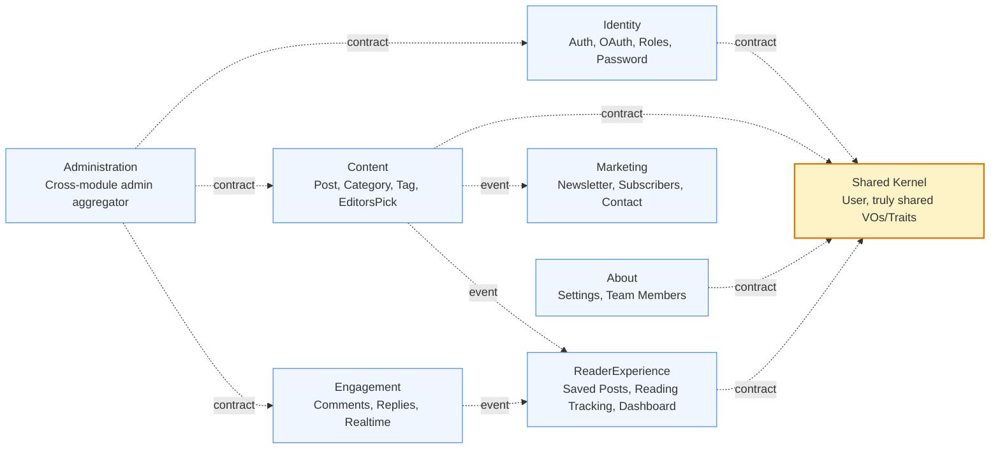
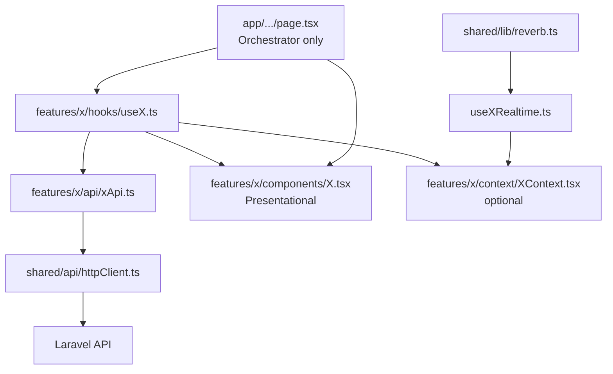
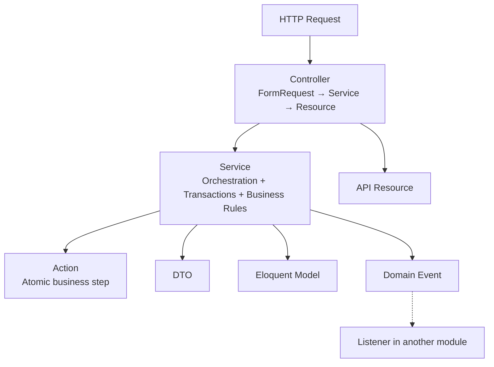

# Architecture Constitution — Larablog  
**Single Source of Truth**

> **Philosophy**  
> This project is a **Pragmatic Modular Monolith** with Lightweight Domain-Driven Design.  
> We strictly enforce Bounded Context boundaries while fully embracing Laravel’s Active Record nature.  
> Eloquent Models are the Domain Entities. Business logic lives in Services and Actions.  
> On the frontend we use a strict feature-based architecture: pages only orchestrate, hooks own all logic, components are purely presentational.  
> No unnecessary repositories, no pure Domain entities with mappers, no over-engineering.  
> Clean, testable, fast to develop, and strictly bounded modules on both backend and frontend.

This document is the **only authoritative source** for every developer and AI.  
Any code that violates these rules is considered incorrect and must be refactored.

---

## 1. Bounded Contexts (Modules)



· Every feature must belong to exactly one module.
· Modules never import another module’s Models, Controllers, or internal classes.
· Communication is allowed only through the two legal channels defined in Article IV.
· Administration exists as a lightweight aggregator for admin endpoints that need data from multiple modules. It contains no business logic, only coordination of existing services.

---

2. Backend Directory Structure

```text
larablog-api/
├── app/                              # Framework bootstrap only
│   └── Providers/AppServiceProvider.php
├── bootstrap/
├── config/
│   └── modules.php                   # Registry of enabled modules
├── database/
│   ├── migrations/                   # FLAT – module-prefixed timestamps
│   ├── seeders/
│   └── factories/
├── routes/
│   ├── api.php                       # Only loads module route files
│   ├── channels.php
│   └── web.php
├── tests/
│   ├── Architecture/                 # Pest arch tests (boundaries)
│   ├── Feature/
│   └── Unit/
└── src/
    ├── Shared/                       # SHARED KERNEL (keep extremely lean)
    │   ├── Models/
    │   │   └── User.php
    │   ├── ValueObjects/             # Only truly shared ones (see list)
    │   │   ├── Slug.php
    │   │   ├── Email.php
    │   │   └── ReadingTime.php
    │   ├── Traits/
    │   │   └── HasUuid.php
    │   └── SharedServiceProvider.php
    └── Modules/
        ├── Identity/
        ├── Content/
        ├── Engagement/
        ├── ReaderExperience/
        ├── Marketing/
        ├── About/
        └── Administration/          # Lightweight, coordination only
```

Shared Kernel initial inventory:

· Models: User (the only shared Eloquent model)
· ValueObjects: Slug, Email, ReadingTime
· Traits: HasUuid

Any addition to Shared Kernel requires a deliberate review to avoid bloating it.

2.1 Module Skeleton (mandatory for every module)

```text
src/Modules/{Context}/
├── {Context}ServiceProvider.php
├── Models/                           # Eloquent = Domain Entity
├── Services/                         # Business logic & orchestration
│   └── Contracts/                    # (optional) small interfaces for services consumed externally
├── Actions/                          # Single-purpose, reusable steps
├── DTOs/
├── Http/
│   ├── Controllers/Api/
│   ├── Requests/
│   └── Resources/
├── Policies/                         # Authorization lives here
├── Events/
├── Listeners/
├── Jobs/                             # (if needed)
├── Mail/                             # (if needed)
└── Routes/
    ├── api.php                       # Public + authenticated endpoints
    └── admin.php                     # Admin endpoints (prefix /admin)
```

For modules that only aggregate data (like Administration), the skeleton can be simpler (no Models, no Events, no Policies). However, the mandatory parts (ServiceProvider, Routes, Http) must still exist.

---

3. Frontend Directory Structures

3.1 Next.js Public Site (App Router)

```text
larablog-web/
├── app/                                      # THIN orchestrator only
│   ├── (auth)/
│   │   ├── login/page.tsx
│   │   ├── register/page.tsx
│   │   ├── forgot-password/page.tsx
│   │   └── reset-password/page.tsx
│   ├── (public)/
│   │   ├── layout.tsx                        # Shell + realtime user channel
│   │   ├── page.tsx                          # Home
│   │   ├── post/[slug]/page.tsx
│   │   ├── category/[slug]/page.tsx
│   │   ├── tag/[slug]/page.tsx
│   │   ├── author/[username]/page.tsx
│   │   ├── about/page.tsx
│   │   └── contact/page.tsx
│   ├── (dashboard)/
│   │   ├── layout.tsx
│   │   ├── dashboard/page.tsx
│   │   ├── dashboard/saved-posts/page.tsx
│   │   └── dashboard/settings/page.tsx
│   ├── layout.tsx                            # Root + Providers
│   └── globals.css
├── src/
│   ├── features/                             # Domain modules (mirrors backend)
│   │   ├── auth/
│   │   ├── posts/
│   │   ├── comments/
│   │   ├── categories/
│   │   ├── tags/
│   │   ├── authors/
│   │   ├── dashboard/
│   │   ├── newsletter/
│   │   ├── contact/
│   │   └── about/
│   ├── shared/
│   │   ├── api/
│   │   │   ├── httpClient.ts                 # Axios instance + interceptors
│   │   │   └── endpoints.ts
│   │   ├── lib/
│   │   │   ├── reverb.ts                     # Echo + Reverb config
│   │   │   ├── seo.ts
│   │   │   └── format.ts
│   │   ├── hooks/
│   │   │   ├── useDebounce.ts
│   │   │   └── usePagination.ts
│   │   ├── types/
│   │   │   └── api.ts                        # ApiResponse<T>, Paginated<T>
│   │   └── config/env.ts
│   └── providers/
│       ├── AppProviders.tsx
│       ├── QueryProvider.tsx                 # React Query
│       ├── AuthProvider.tsx
│       └── ThemeProvider.tsx
├── middleware.ts                             # Auth gate for /dashboard
└── next.config.ts
```

3.2 React Admin Panel (Vite)

```text
larablog-admin/
└── src/
    ├── app/
    │   ├── App.tsx
    │   ├── router.tsx
    │   └── providers.tsx
    ├── pages/                                # Thin orchestrators
    │   ├── Login.tsx
    │   ├── Dashboard.tsx
    │   ├── Posts.tsx
    │   ├── PostEditor.tsx
    │   ├── Categories.tsx
    │   ├── Tags.tsx
    │   ├── Comments.tsx
    │   ├── Users.tsx
    │   └── AboutTeam.tsx
    ├── features/
    │   ├── auth/
    │   ├── posts/
    │   ├── categories/
    │   ├── tags/
    │   ├── comments/
    │   ├── users/
    │   └── team/
    └── shared/
        ├── api/httpClient.ts                 # Token from localStorage
        ├── components/                       # AdminLayout, Sidebar, DataTable, ConfirmDialog
        ├── hooks/usePermissions.ts
        └── lib/format.ts
```

3.3 Mandatory Feature Anatomy (both Next.js and Admin)

Every feature must follow this exact internal structure:

```text
src/features/{domain}/
├── api/
│   └── {domain}Api.ts                # Pure fetch functions (no React)
├── hooks/
│   ├── use{Something}.ts             # All logic, React Query, state, side-effects
│   └── use{Something}Realtime.ts     # (if needed)
├── components/                       # Presentational only
│   ├── {Name}.tsx
│   └── ...
├── context/                          # Only when cross-component state is truly needed
│   └── {Domain}Context.tsx
├── types/
│   └── {domain}.ts
└── index.ts                          # Public barrel (export only what other features may use)
```

---

4. Frontend Data Flow (Mandatory)



Rules:

· A page never imports httpClient, never calls fetch, never holds business state.
· A component never imports hooks that fetch data or httpClient. It only receives props and emits events.
· All data fetching, caching, mutations, optimistic updates and realtime subscriptions live inside hooks.

---

5. Layer Dependency Flow (Backend)



---

6. Constitution — Non-Negotiable Rules

Article I — Thin Controllers

Controllers do only three things:

1. Receive already-validated FormRequest
2. Call exactly one Service method (passing DTO or validated data)
3. Return an API Resource or JSON response

Forbidden: any business logic, DB::, direct Eloquent queries, transactions.

Article II — Pragmatic DDD

· Eloquent Models are the Domain Entities.
· Services talk directly to Eloquent Models.
· Prefer Local Scopes on Models.
· Do not create Repository interfaces by default.
· Create DTOs for any write operation that has ≥ 2 meaningful parameters.
· Extract an Action when logic is reused or a Service method grows complex.

Article III — Strict Module Boundaries

· Never import another module’s Model, Controller, or internal class.
· Allowed: importing from Shared\.
· Enforced by Pest Architecture tests that fail the build on violation.

Article IV — Cross-Module Communication

Type When How
Synchronous (Read) Need data from another module in the same request Inject the other module’s public Service (preferably via a small interface defined in that module’s Services/Contracts/ to document the contract)
Asynchronous (Write / Side-effect) React after something happened Dispatch a Domain Event. Other modules listen.

Note: Even without an interface, you must never access another module’s Model directly. Using the public Service is the only allowed synchronous path.

Article V — Frontend Layering (Strict)

Layer Responsibility Forbidden
app/ or pages/ Compose hooks + presentational components Any fetch, business if, React Query, state that is not pure UI
features/*/hooks All business logic, API calls, React Query, realtime, transformations Returning JSX
features/*/components Pure presentation (props in, events out) useQuery, useMutation, httpClient, business conditions
features/*/context Shared state across components of the same feature Direct API calls
shared/ Generic utilities Importing anything from features/

Article VI — React Query Rules (Mandatory)

· Every server state must go through React Query.
· Query keys must be structured and exported from the feature:
  ```ts
  export const postKeys = {
    all: ['posts'] as const,
    lists: () => [...postKeys.all, 'list'] as const,
    list: (filters: PostFilters) => [...postKeys.lists(), filters] as const,
    details: () => [...postKeys.all, 'detail'] as const,
    detail: (slug: string) => [...postKeys.details(), slug] as const,
  };
  ```
· Mutations must invalidate the correct query keys.
· Prefer optimistic updates for save/unsave, like/unlike, etc.
· Never call httpClient directly inside a component or page.

Article VII — Authentication & Realtime

· Public Next.js: Sanctum cookie-based (withCredentials: true).
    Auth state lives in AuthProvider + useAuth hook.
· Admin: Sanctum token in localStorage + Axios interceptor.
· Realtime (Reverb):
  · Configuration only in shared/lib/reverb.ts.
  · Subscriptions only inside feature hooks (useCommentRealtime, etc.).
  · Always clean up subscriptions in useEffect return.
· Middleware protects /dashboard routes.

Article VIII — Error Handling & Loading States (Frontend & Backend)

Frontend:

· Hooks must return a consistent shape:
  ```ts
  { data, isLoading, isError, error, … }
  ```
· Components receive isLoading / isError as props and render skeletons or error UI.
· Global error boundary exists in root layout.
· Toast notifications are triggered only from hooks (never from presentational components).

Backend:

· Services throw a module-specific DomainException (or a custom exception implementing a shared DomainExceptionInterface) when a business rule is violated.
· Controllers do not catch these exceptions.
· The global ExceptionHandler converts them into appropriate JSON responses with proper HTTP status codes.
· Infrastructure/technical exceptions (e.g., database failures) are handled by the same handler; services should not need to worry about them.

Article IX — SEO (Next.js only)

· Every public page must export generateMetadata.
· Use helpers from shared/lib/seo.ts.
· Structured data (JSON-LD) for posts and authors is mandatory.

Article X — Authentication & Authorization (Backend)

· Public: Sanctum cookie SPA.
· Admin: Sanctum token.
· Authorization: Spatie + Policies (Policies live inside each module).

Article XI — Database

· Migrations stay flat in database/migrations/.
· Filename: YYYY_MM_DD_HHMMSS_{module}_{description}.php
· Alternative: If the number of modules grows large, consider using loadMigrationsFrom() in each module’s ServiceProvider and keeping migrations inside the module. Until then, flat with prefix is the default.

Article XII — Naming Conventions

Element Convention Example
Module Modules\{Context} Modules\Content
Model Singular Post
Service {Aggregate}Service PostService
Action {Verb}{Aggregate}Action PublishPostAction
DTO {Aggregate}{Purpose}DTO PostCreateDTO
Event Past tense PostPublished
FormRequest {Verb}{Aggregate}Request StorePostRequest
Resource {Aggregate}Resource PostResource
Policy {Aggregate}Policy PostPolicy
Frontend Hook use{Something} usePostList
Frontend API file {domain}Api.ts postsApi.ts

Article XIII — File Size & Complexity (Soft Rule)

· Prefer ≤ 180–200 lines.
· Service grows → extract Actions.
· Component grows → split.
· Page contains logic → move to hook.

Article XIV — Testing Strategy

1. Architecture tests (Pest) – boundaries. Must run first in CI (milliseconds). Example:
   ```php
   // tests/Architecture/BoundaryTest.php
   test('no module may import another modules model')
       ->expect('Modules\\Content')
       ->not->toUse('Modules\\Engagement\\Models')
       ->and('Modules\\Engagement')
       ->not->toUse('Modules\\Content\\Models');
   ```
2. Feature tests – HTTP → DB. Use RefreshDatabase.
3. Service tests – Use RefreshDatabase to confirm integration with Eloquent. Run with php artisan test --parallel for speed.
4. Unit tests – pure functions, ValueObjects, Actions (can run without Laravel boot for speed).
5. Frontend tests – React Testing Library for hooks and critical components + Playwright for key user journeys.

---

7. Phase → Module Mapping

Phase Primary Module(s) Notes
1 Identity Auth, roles, OAuth
2 Content CRUD Posts, Categories, Tags
3 Content + Identity Public read APIs
4 Engagement Comments + Reverb
5 ReaderExperience Saved posts, dashboard
6 Marketing Newsletter, contact
7 Content Enhancements
8 About, Administration Settings, Team, Admin dashboard aggregation

---

8. Developer & AI Playbook

When a new requirement arrives:

1. Does it belong to an existing Bounded Context?
   · Yes → extend that module.
   · No → create a new module following the exact skeleton.
2. Decision table:

Requirement Create Location Communication
New entity Model + Migration + Service + Controller + Resource + Routes + Policy New or existing module Events or Service calls
New field on existing entity Migration + update Model + Resource + DTO Existing module None
New endpoint Controller method + Service method + Route Existing module Existing channels
New business rule Action or Service method Existing module None
Reaction to another module Listener Your module Domain Event
New admin aggregation Add lightweight endpoint in Administration module (calls Services from other modules) Modules/Administration Service injection only
New frontend page / feature Page (orchestrator) + Hook + Components + api file features/{domain} httpClient via hooks

Concrete example – adding Bookmarks (full stack):

Backend

1. New module src/Modules/Bookmarks/ with full skeleton.
2. Migration with correct prefix.
3. Register PSR-4 + ServiceProvider.
4. Needs User → Shared\Models\User.
5. Needs Post → inject Content\Services\PostService (prefer interface if exists), never import Model.

Frontend

1. Create src/features/bookmarks/ with the mandatory anatomy.
2. bookmarksApi.ts → pure functions.
3. useBookmarks.ts + useToggleBookmark.ts (React Query + optimistic).
4. Presentational BookmarkButton.tsx.
5. Page under dashboard only composes the hook + button.
6. Write tests.

---

9. Concrete Frontend Example (Reference Implementation)

app/(public)/post/[slug]/page.tsx (≈ 25–35 lines)

```tsx
export default function PostPage({ params }: { params: { slug: string } }) {
  const { data: post, isLoading, isError } = usePost(params.slug);
  const { data: comments } = useComments(post?.id);
  useCommentRealtime(post?.id);          // side-effect only
  const { toggle, isSaved } = useSavePost(post?.id);

  if (isLoading) return <PostSkeleton />;
  if (isError || !post) return <NotFound />;

  return (
    <>
      <PostBody post={post} />
      <AuthorBox author={post.author} />
      <SaveButton isSaved={isSaved} onToggle={toggle} />
      <CommentSection comments={comments} postId={post.id} />
      <RelatedPosts postId={post.id} />
    </>
  );
}
```

features/posts/hooks/usePost.ts

```ts
export function usePost(slug: string) {
  return useQuery({
    queryKey: postKeys.detail(slug),
    queryFn: () => postsApi.getBySlug(slug),
    enabled: !!slug,
  });
}
```

This pattern is mandatory for every page.

---

10. Golden Rules (Memorize)

1. Do not fight Laravel. Use Eloquent, FormRequests, and Policies as first-class tools.
2. No over-engineering. Only add abstractions that solve a real, current problem.
3. Boundaries are sacred. Never reach into another module’s internals.
4. Controllers stay dumb. Services stay smart.
5. Frontend pages only compose. Hooks own logic. Components only present.
6. All server state goes through React Query.
7. When in doubt, ask: “Which Bounded Context owns this business rule?”

---

11. Quick Bootstrap Checklist

1. Laravel project + move business code under src/Modules + PSR-4.
2. Install Sanctum, Spatie Permission, Fortify/Socialite, Reverb.
3. Create lean Shared Kernel (only the items listed above).
4. Fully implement Identity module as the reference skeleton.
5. Create the Administration module (even if minimal) to handle cross-module admin routes.
6. Add Pest Architecture tests → CI fails on boundary violation.
7. Scaffold Next.js + Admin with feature-based structure + React Query + AuthProvider.
8. Write CONTRIBUTING.md that points everyone to this Constitution.

---

This document is the Single Source of Truth for both Backend and Frontend.
Any deviation is technical debt and must be corrected.

Keep it strict. Keep it pragmatic. Ship clean, consistent code.